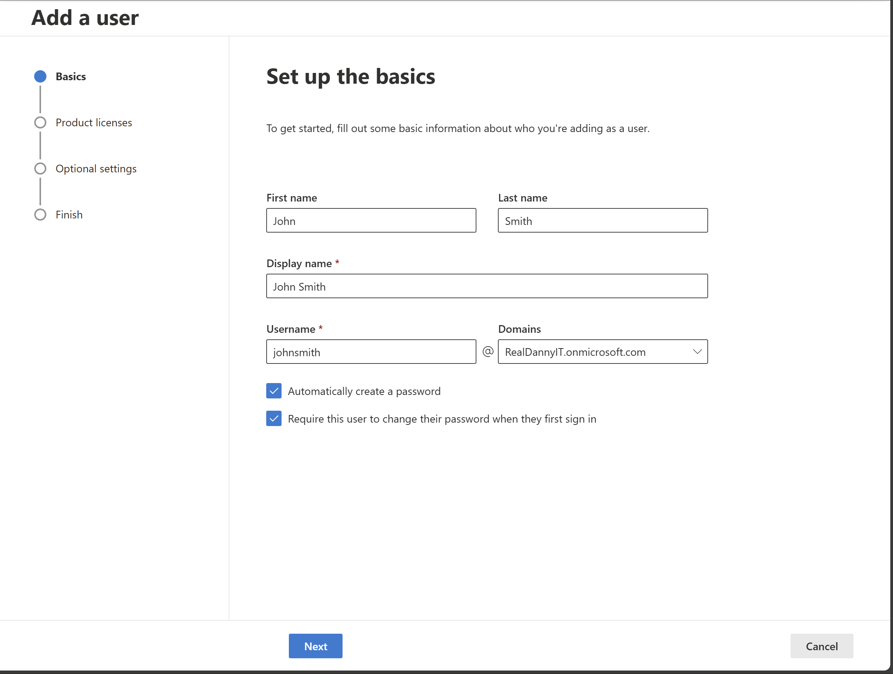
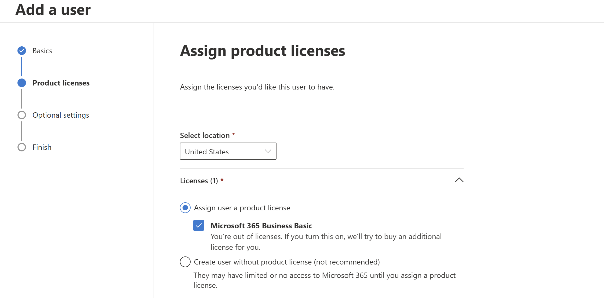
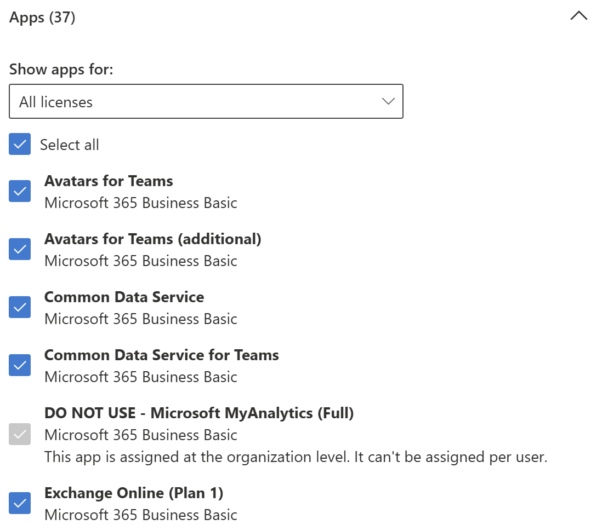
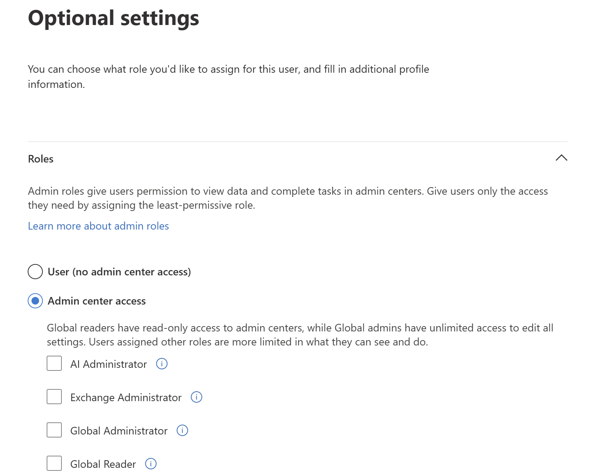
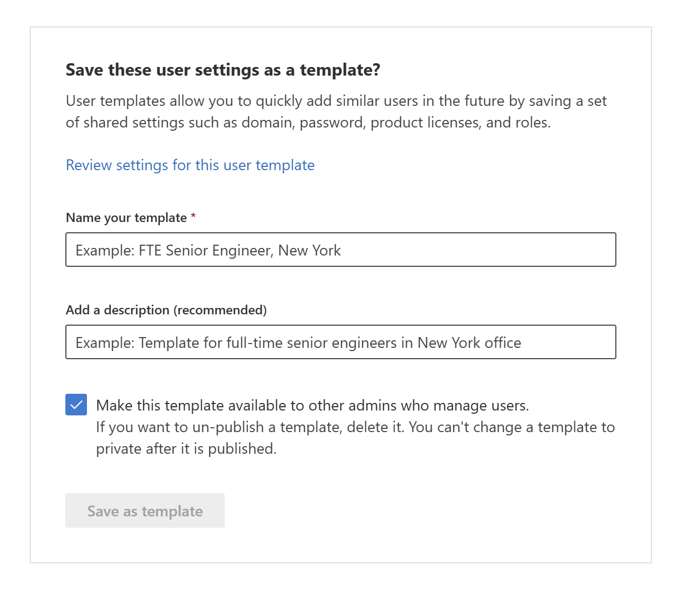
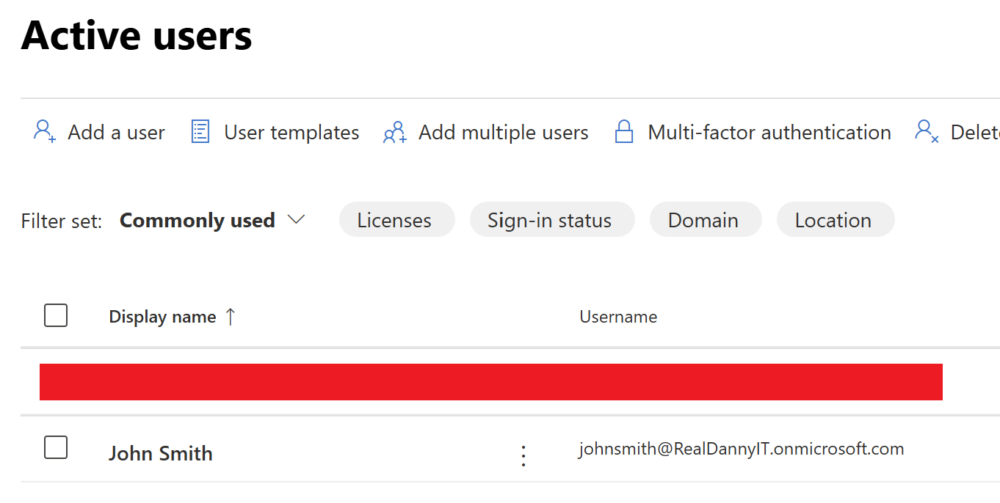

# Microsoft 365 User Creation

We can add a user to our organization in the Microsoft 365 admin center. We go to:

## Acknowledgements
This lab was done with the help of [Cobuman's Office 365 training series](https://www.youtube.com/playlist?list=PL4jgQJG6eMDPBHQ4UHueb1xoABkGO6WbQ).

## Creation 

```Users > Active users > Add a user```

Here we'll be prompted to add basic personal information.



Next, we'll assign a license to our new user.



Now we can add apps associated with the license to our user.



After, we can assign a role to the user if they are managing or adminstering any services.



If we plan on creating a user with the same settings in the future, then we save them as a template.



Our new user should now appear in the Active users section!

